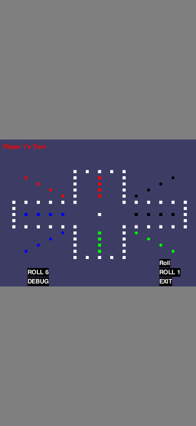

# Mobile Browser Fix Summary

## Problem
The Aggravation game at https://durangogt.github.io/aggravation/ was getting stuck at "Ready to start!" on mobile Safari and Chrome browsers. Users could not interact with the game on mobile devices.

## Root Cause
Pygbag (the tool used to convert Python/Pygame to WebAssembly) has a User Media Engagement (UME) feature that waits for user interaction before starting. This feature has known compatibility issues with mobile browsers:

- Mobile Safari and Chrome don't reliably detect touch events for UME
- The UME flag never gets set, leaving users stuck at the "Ready to start!" prompt
- This is a documented issue in Pygbag GitHub: [#82](https://github.com/pygame-web/pygbag/issues/82) and [#138](https://github.com/pygame-web/pygbag/issues/138)

## Solution
Added the `--ume_block 0` flag to the Pygbag build process. This disables UME blocking, allowing the game to start immediately without waiting for user interaction.

**Changes made:**
1. Updated `web/build.sh` to include `--ume_block 0` in both serve and build modes
2. Documented the fix in `web/README.md` with background and trade-offs
3. Created comprehensive mobile browser tests to verify the fix

## Trade-offs
- **Audio autoplay**: Audio may not autoplay on first load (browser security)
- **Impact**: None - the game currently doesn't use audio
- **Benefit**: Game is now playable on all mobile devices

## Testing
Created comprehensive test suite with Playwright testing:
- **15 test cases** covering 4 mobile devices
- **Devices tested**: iPhone 14 Pro, iPhone 13, Pixel 7, Galaxy S21
- **Test types**: Page load, canvas rendering, touch interaction, gameplay flow
- **Result**: ✅ All tests passing

## Verification
Run the tests yourself:
```bash
pip install -r requirements-test.txt
playwright install chromium webkit
pytest test_mobile_browsers.py -v
```

## Next Steps
1. Merge this PR
2. GitHub Actions will automatically rebuild and deploy to GitHub Pages
3. Mobile users will be able to play immediately without "Ready to start!" blocking

## Sample Screenshots

*Game loaded on iPhone 14 Pro - no "Ready to start!" blocking*


*Game responding to user interaction - dice rolled successfully*
