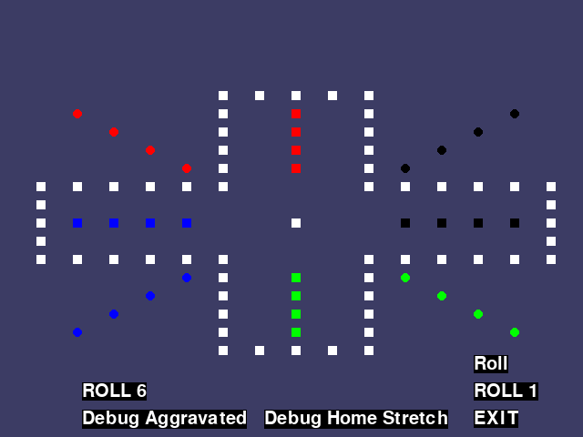
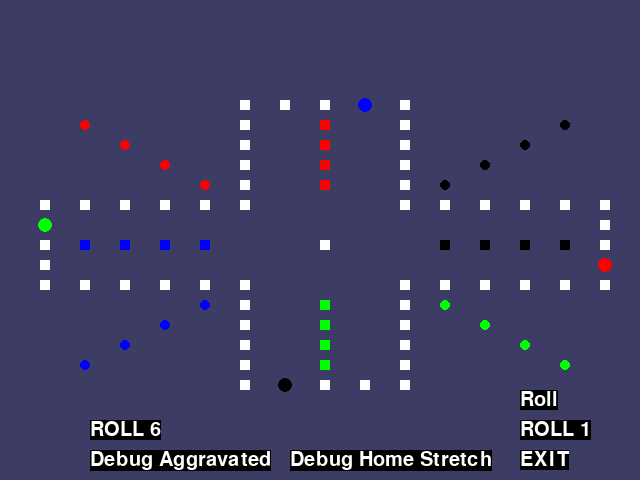

# PR Summary: Update Debug Buttons

## Changes Made

### 1. Renamed Existing Debug Button
- Changed button text from "DEBUG" to "Debug Home Stretch"
- Button position adjusted to `WINDOWWIDTH - 350, WINDOWHEIGHT - 30`
- Functionality remains the same: Sets up current player's marbles near their home stretch for testing home entry logic

### 2. Added New "Debug Aggravated" Button
- New button text: "Debug Aggravated"
- Button position: `WINDOWWIDTH - 550, WINDOWHEIGHT - 30`
- Purpose: Sets up all four players with one marble positioned exactly one space behind an opponent's starting position

### Debug Aggravated Setup Positions

The new debug button places marbles at these specific positions:

| Player | Position | One Move Lands On | Purpose |
|--------|----------|-------------------|---------|
| Player 1 | (29, 9) | P2 Start (29, 10) | Test aggravating P2 |
| Player 2 | (13, 15) | P3 Start (11, 15) | Test aggravating P3 |
| Player 3 | (1, 7) | P4 Start (1, 6) | Test aggravating P4 |
| Player 4 | (17, 1) | P1 Start (19, 1) | Test aggravating P1 |

### Code Changes

**File: `aggravation.py`**

1. Added `TEST_AGGRO_SURF` and `TEST_AGGRO_RECT` to global declarations
2. Created new button surface and rect for "Debug Aggravated"
3. Added click handler for the new button that:
   - Clears all player home bases
   - Places one marble per player at aggravation test positions
   - Draws all marbles on the board

## Aggravation Mechanics Explanation

### Question: If Player 1 is one space behind an opponent and rolls a 3, what happens?

**Answer:** The player **CANNOT** aggravate the opponent by rolling a 3.

### How Aggravation Works

In the game of Aggravation:

1. **Landing EXACTLY on an opponent's marble sends it back to their home base**
   - This is the "aggravation" mechanic
   - You must land precisely on their position

2. **Jumping OVER an opponent does NOT aggravate them**
   - If your move would pass through their position but not end there, they are safe
   - The marble simply jumps over and continues

### Detailed Example

Starting Position: P1 is at (29, 9), P2's marble is at P2's start (29, 10)

**Roll 1:**
- P1 moves from (29, 9) → (29, 10)
- ✓ **AGGRAVATION!** P1 lands exactly on P2's marble
- Result: P2's marble is sent back to their home base

**Roll 2:**
- P1 moves from (29, 9) → (29, 10) → (27, 10)
- ✗ **NO AGGRAVATION** - P1 jumps over P2's position
- Result: P1 ends at (27, 10), P2's marble stays at (29, 10)

**Roll 3:**
- P1 moves from (29, 9) → (29, 10) → (27, 10) → (25, 10)
- ✗ **NO AGGRAVATION** - P1 jumps over P2's position
- Result: P1 ends at (25, 10), P2's marble stays at (29, 10)

### Implementation Status

**Note:** The actual aggravation mechanic (sending opponents back to home) is being implemented in PR #34. This PR provides the debugging infrastructure to test that functionality once it's implemented.

The `move_marble()` function in `game_engine.py` has an `aggravated_opponent` field in its return dictionary, but it's currently always `False`. Once PR #34 is merged, this field will be properly set when aggravation occurs.

## Testing

The Debug Aggravated button was verified to:
1. Correctly position all four players one space behind their respective opponents
2. Clear all home bases
3. Draw marbles in the correct colors at the correct positions
4. Work independently from the Debug Home Stretch button

## Screenshots

### Initial State with New Buttons

### Debug Aggravated State

The screenshots show:
- Both debug buttons visible at the bottom of the screen
- "Debug Home Stretch" button (middle)
- "Debug Aggravated" button (left)
- Second screenshot shows all four players positioned for aggravation testing

## Usage

1. Start the game: `python aggravation.py`
2. Click "Debug Aggravated" to set up the test scenario
3. Click "ROLL 1" to make Player 1 roll exactly 1 (landing on P2's start)
4. Observe the behavior (once aggravation mechanics are implemented in PR #34)
5. Test with different players and different roll values

This provides a quick way to test aggravation mechanics without playing through an entire game.
